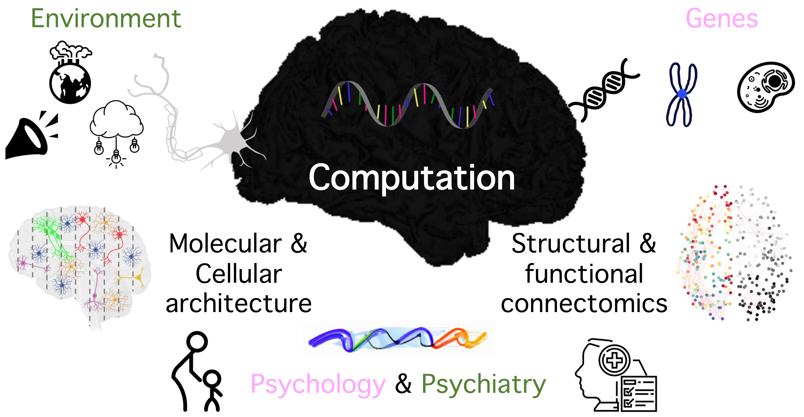

# Gene-environment effects on brain and cognitive development
### My name is Bin Wan, a researcher interested in cognitive neurogenetics.  
### Personal website visit: <a href="https://wanb-psych.netlify.app" target="_blank">wanb-psych.netlify.app</a>

<!--
**wanb-psych/wanb-psych** is a ✨ _special_ ✨ repository because its `README.md` (this file) appears on your GitHub profile.

Here are some ideas to get you started:

- 🔭 I’m currently working on ...
- 🌱 I’m currently learning ...
- 👯 I’m looking to collaborate on ...
- 🤔 I’m looking for help with ...
- 💬 Ask me about ...
- 📫 How to reach me: ...
- 😄 Pronouns: ...
- ⚡ Fun fact: ...
-->
